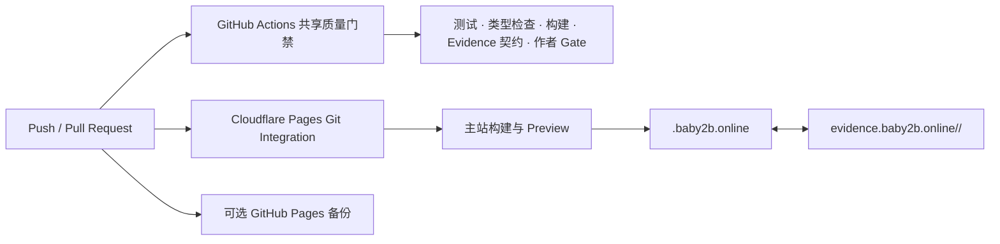

# Baby2B 项目统一发布设计

日期：2026-08-09  
状态：已确认设计，待实施计划

## 1. 目标

为 `Tiancheng-Xu` 名下仓库建立一致、可审计的发布方式：

- 可发布 Web 项目的生产入口统一为 `<project>.baby2b.online`；
- 项目 Evidence 统一为 `evidence.baby2b.online/<project>/`；
- 项目页与 Evidence 页提供互相可见的入口；
- GitHub Actions 负责质量门禁和可选的 GitHub Pages 备份；
- Cloudflare Pages Git Integration 直接监听 GitHub，负责主站构建和发布；
- `*.pages.dev` 仅作为诊断与回滚入口，不能当作生产验收完成；
- 不为每个仓库复制或新建长期 Cloudflare API Token。

该规范覆盖所有仓库的审计。只有存在可部署 Web 产物的仓库创建域名；库、CLI、纯文档或归档仓只接入质量门禁与 Evidence 索引。

## 2. 已验证基线

BabySteps 是本规范的真实基线：

| 项目 | 已验证值 |
|---|---|
| GitHub 仓库 | `Tiancheng-Xu/babysteps` |
| Cloudflare Pages 项目 | `babysteps` |
| Pages 默认域名 | `babysteps-83x.pages.dev` |
| 发布方式 | GitHub 原生 Git Integration |
| 生产分支 | `main` |
| 构建命令 | `pnpm build` |
| 产物目录 | `web/dist` |
| 生产域名 | `babysteps.baby2b.online` |
| DNS | 代理 CNAME 指向 Pages 默认域名 |
| 域名状态 | Domain、validation、verification 均为 active |
| GitHub Actions | 校验并发布 GitHub Pages 备份，不上传 Cloudflare |

[Cloudflare 官方文档](https://developers.cloudflare.com/pages/framework-guides/deploy-a-nuxt-site/#git-integration)明确说明：现有 Direct Upload Pages 项目不能追加 Git Integration，必须创建新的 Pages 应用。因此迁移必须采用并行新建、验证后切流，不能原地假装转换。

## 3. 推荐架构



GitHub Actions 与 Cloudflare 不是“Action 把文件传给 Cloudflare”的串行关系，而是监听同一次 GitHub 变更的两条独立链路。这样既保留 CI 门禁，也不需要在每个仓库保存 Cloudflare Token。

## 4. 组件边界

### 4.1 全局 Codex Skill

创建 `publish-baby2b-project`，负责有判断的跨系统编排：

1. 识别仓库类型、生产分支、包管理器、构建命令和产物目录；
2. 检查共享工作流、作者署名 gate 和 Evidence 契约；
3. 检查 Cloudflare GitHub App 是否仅授权所需仓库；
4. 创建或核对 Git-integrated Pages 项目；
5. 创建代理 CNAME，并等待 Domain、validation、verification 与公开 TLS 全部通过；
6. 验证项目页和 Evidence 页的双向入口；
7. 保存脱敏的架构、关键步骤、失败、修复和复验记录；
8. 只有新入口验收通过后，才允许停用旧 Direct Upload 项目。

Skill 不保存 Token、Account ID、Zone ID、Cookie、OAuth code 或用户登录信息。登录、GitHub App 授权、权限扩大和删除旧项目仍遵守动作时确认。

### 4.2 `Tiancheng-Xu/.github` 共享能力

共享仓库提供：

- 可复用质量门禁 workflow；
- 发布元数据契约与校验器；
- 项目/Evidence 双向导航契约；
- `baby2b.online` 域名和 Pages 状态的只读验收；
- 供各仓库复制的薄调用 workflow 模板。

共享 workflow 不持有 Cloudflare 部署凭据，也不跨仓写代码或 Evidence。

### 4.3 项目仓库

每个 Web 项目只维护自身事实：

- 构建命令；
- 产物目录；
- 项目 slug；
- 生产域名；
- Evidence URL；
- 可选备份 URL；
- 项目级测试命令。

项目仓不得把账号信息、训练数据、模型文件或私有 Evidence 混入公开产物。

### 4.4 Evidence 仓库

Evidence 仓按 slug 隔离项目页面。每个项目至少包含：

- 成果摘要和真实状态；
- 系统、训练或交付架构；
- 关键实现图例；
- 问题、根因、修复与复验；
- 公开安全边界；
- 项目页返回入口。

## 5. 发布元数据契约

每个 Web 项目提供一份机器可读的最小配置：

```yaml
schema-version: 1
slug: personal-ai-agent
site-kind: project
production-branch: main
build-command: pnpm portfolio:build
output-directory: apps/portfolio/dist
pages-project: personal-ai-agent-site
production-url: https://personal-ai-agent.baby2b.online/
evidence-url: https://evidence.baby2b.online/personal-ai-agent/
backup-url: ""
```

字段值必须来自仓库实际命令与 Cloudflare 实际配置，不允许通过模板猜测。

`site-kind` 只允许 `project` 或 `evidence-hub`。项目配置的 `evidence-url` 必须以项目 slug 结尾；Evidence Hub 配置的 `production-url` 与 `evidence-url` 都指向 Hub 根地址，具体项目的双向导航由各 case manifest 验证。

## 6. 当前 Personal AI Agent 迁移

当前 `personal-ai-agent` 与 `baby2b-online-deployment-evidence` Pages 项目均为 Direct Upload。迁移步骤为：

1. 保留两个现有项目和默认域名作为回滚现场；
2. 创建两个 Git-integrated Pages 项目，并只授权对应私有仓库；
3. 配置实际构建命令和产物目录；
4. 在新 Pages 默认域名完成内容校验；
5. 把两个自定义域名从旧项目迁移到新项目；
6. 创建代理 CNAME 并验证 TLS；
7. 复验项目/Evidence 双向入口和公开内容扫描；
8. 合并两个已通过 CI 的 PR；
9. 观察一次 `main` 自动构建成功后，再决定是否删除旧 Direct Upload 项目。

任何一步失败都保留旧项目，不删除 DNS 或生产可用入口。

## 7. 状态与错误处理

发布状态固定为：

1. `configured`：仓库和 Pages Git Integration 已连接；
2. `built`：默认 Pages 域名内容正确；
3. `dns-pending`：CNAME 已提交但尚未完全生效；
4. `tls-pending`：DNS 正确但证书未 active；
5. `active`：自定义域名 HTTPS、内容与双向导航均通过；
6. `rollback`：新链路失败，继续使用旧入口。

不得用 `pages.dev` 可访问替代 `active`，不得把 pending 写成完成。

## 8. 安全模型

- Cloudflare GitHub App 使用 “Only select repositories”；
- 新仓库接入前检查授权范围，不默认授权全部仓库；
- GitHub Actions 不保存 Cloudflare API Token；
- 不为解决单次部署重复创建长期 Token；
- 公开扫描拒绝密钥、邮箱、账号 ID、训练 JSONL、Adapter、GGUF 和未知资产；
- 所有外部删除、权限扩大、生产 DNS 替换在动作时确认；
- 作者署名 gate 在提交和远端发布前执行。

## 9. 验收

单项目完成必须同时满足：

- Pull Request 的共享质量门禁通过；
- Cloudflare Git Integration 来源、分支、构建命令和产物目录正确；
- 默认 Pages 域名返回预期页面；
- 生产域名为代理 CNAME，指向实际 Pages 子域名；
- Cloudflare Domain、validation、verification 全部 active；
- 生产 HTTPS 返回 2xx，证书和页面标题正确；
- Desktop 与 H5 不发生关键布局回归；
- 项目页和 Evidence 页双向跳转正确；
- Evidence 展示真实架构、图例和排障记录；
- 无凭据或私有训练资产进入公开产物；
- 推送 `main` 后 Cloudflare 自动构建成功。

## 10. 推广顺序

1. 先在 Personal AI Agent 与 Evidence 双仓验证规范；
2. 将验证后的流程固化为全局 Skill 和共享 workflow；
3. 只读审计其他 GitHub 仓库并分类；
4. 对可发布 Web 项目逐仓提交小型接入 PR；
5. 逐个验证 `*.baby2b.online`，不批量切换未验收域名。

该顺序防止一个共享配置错误同时破坏全部项目。
