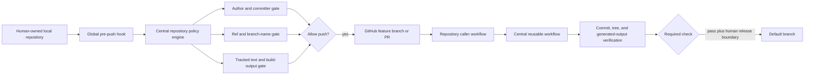

# Repository Content Policy Design

> Date: 2026-08-10  
> Status: approved for implementation; production deployments remain separately gated.

## Goal

Apply one verifiable repository policy to every current and future project owned by
`Tiancheng-Xu`, while keeping the private, no-origin learning-notes repository
strictly read-only and outside product-content enforcement.

The policy must prevent automation identities from becoming project authors,
prevent prohibited product wording and legacy brand aliases from entering public
source or generated sites, and make a missing remote verification workflow a
blocking delivery condition.

## Scope

- Local: every Git repository on this Mac inherits a global `pre-push` hook.
- Remote: all 13 current repositories receive a caller workflow or an explicit
  empty-repository record; future repositories use the same bootstrap contract.
- TC Flow: N7 checks the policy in audit mode and N8 requires the blocking local
  and remote gates before push.
- Existing training, model, dataset, and evidence artifacts remain private and are
  never uploaded merely to satisfy the policy.
- The no-origin learning-notes repository is not modified.

## Architecture

The central `.github` repository is the policy source of truth. Its policy engine
is consumed by both the local hook and the GitHub Action. The Evidence repository's
old hook becomes a compatibility wrapper during migration and is no longer the
canonical implementation.

## Policy Contract

### Human authorship

- Pending commits must use the configured repository owner's human Author and
  Committer identity.
- Automation/model identities are rejected in Author, Committer, metadata fields,
  and attribution trailers.
- Existing published history is not rewritten. Every new commit is evaluated.
- Remote CI repeats this check so another machine cannot bypass the local hook.

### Ref names

- New branches and tags must not expose automation identity prefixes or retired
  product aliases.
- Existing non-compliant local branches must be renamed before their first push.

### Public content

- Scan tracked text files across the full candidate tree, not only the latest diff.
  This forces a legacy repository to become clean before its next release.
- Scan the configured production build output separately after building.
- Match configured product-only phrases and retired aliases using encoded policy
  constants so policy fixtures do not leak those terms into product repositories.
- Skip binary files and dependency/vendor/license trees; do not skip first-party
  documentation, metadata, HTML, JSON, YAML, source, or generated site files.

### Remote workflow presence

Every non-empty project repository must contain the byte-for-byte canonical
`.github/workflows/repository-policy.yml` caller. A fixed caller is intentionally less
flexible than arbitrary YAML: it prevents comments, disabled conditions, invalid jobs,
or local remote configuration from imitating an active check. The lightweight policy
workflow verifies commits and source only. A project that declares build output must
also use the shared verifier that actually builds before calling the policy action; a
checkout-only workflow must not pretend to validate a gitignored output directory.
Silently relying on a local hook is not accepted.

## Rollout

1. Implement and test the central policy locally.
2. Install its global hook path on the Mac and prove a compliant and non-compliant
   fixture behave differently.
3. Update the installed `tc-flow` skill and canonical template nodes to require the
   policy without modifying the read-only notes copy.
4. Publish the central policy repository first.
5. Audit 13 remote default branches and classify repositories as compliant,
   repairable, or empty.
6. Open caller/fix PRs per repository. Do not automatically merge a PR when its
   default branch may trigger a production deployment; report that boundary first.
7. Verify required checks and record repository/commit evidence.

## Failure Handling

- Missing policy checkout, owner identity, active pull-request caller, or a declared
  post-build directory is a blocking error, never a warning.
- A binary decoding failure is reported with the path and skipped only when the file
  is positively classified as binary.
- A repository with legacy violations receives a deterministic path list and remains
  blocked until sanitized.
- A remote repository that cannot run Actions is recorded as blocked; it is not
  described as protected.

## Verification

- Node test fixtures cover owner commits, automation attribution, ref names, full-tree
  legacy content, vendor/license exclusions, generated output, empty repositories,
  and multi-ref pushes.
- A local hook dry run proves both allow and block behavior.
- A central Action test proves the reusable workflow calls the same policy entrypoint.
- Per-repository evidence records default branch, caller workflow path, last checked
  commit, check URL/status, and remaining production-release boundary.
